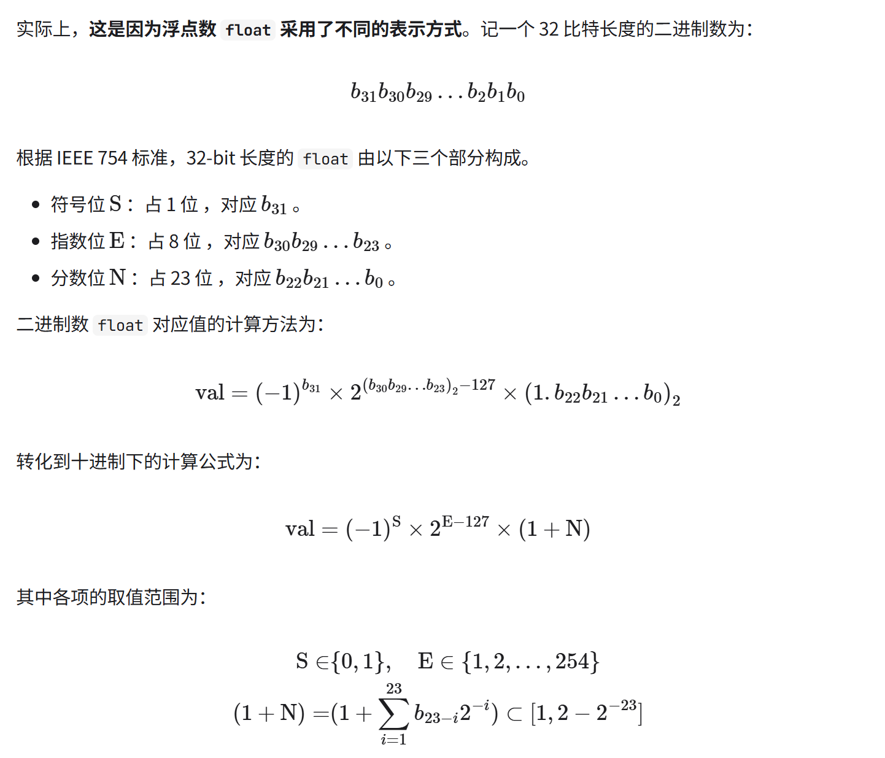
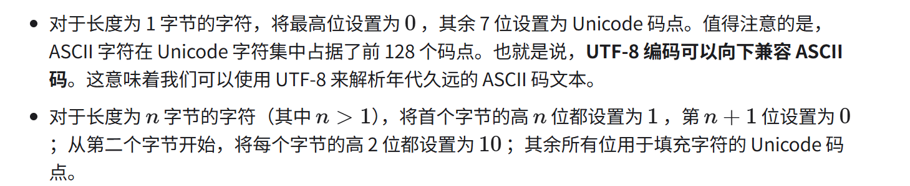

# 数据结构

## 数据结构分类

常见的数据结构包括数组、链表、栈、队列、哈希表、树、堆、图，它们可以从“逻辑结构”和“物理结构”两个维度进行分类。

### 逻辑结构：线性与非线性

逻辑结构揭示了数据元素之间的逻辑关系。在数组和链表中，数据按照一定顺序排列，体现了数据之间的线性关系；而在树中，数据从顶部向下按层次排列，表现出“祖先”与“后代”之间的派生关系；图则由节点和边构成，反映了复杂的网络关系。

* 线性数据结构：数组、链表、栈、队列、哈希表，元素之间是一对一的顺序关系。
* 非线性数据结构：树、堆、图、哈希表。

非线性数据结构可以进一步划分为树形结构和网状结构。

* 树形结构：树、堆、哈希表，元素之间是一对多的关系。
* 网状结构：图，元素之间是多对多的关系。

### 物理结构：连续与分散

物理结构反映了数据在计算机内存中的存储方式，可分为连续空间存储（数组）和分散空间存储（链表）。物理结构从底层决定了数据的访问、更新、增删等操作方法，两种物理结构在时间效率和空间效率方面呈现出互补的特点。

所有数据结构都是基于数组、链表或二者的组合实现的。例如，栈和队列既可以使用数组实现，也可以使用链表实现；而哈希表的实现可能同时包含数组和链表。

* 基于数组可实现：栈、队列、哈希表、树、堆、图、矩阵、张量（维度>=的数组）等。
* 基于链表可实现：栈、队列、哈希表、树、堆、图等。

链表在初始化后，仍可以在程序运行过程中对其长度进行调整，因此也称“动态数据结构”。数组在初始化后长度不可变，因此也称“静态数据结构”。

### 内存和硬盘存储的区别

逻辑结构一样数组还是数组，链表还是链表。
物理存储可以完全不一样

* 内存：为速度服务，连续 / 分散看结构特性。
* 硬盘：为持久服务，几乎永远连续 / 顺序存储。

## 基本数据类型

基本数据类型是 CPU 可以直接进行运算的类型，在算法中直接被使用，主要包括以下几种。

* 整数类型 byte、short、int、long 。
* 浮点数类型 float、double ，用于表示小数。
* 字符类型 char ，用于表示各种语言的字母、标点符号甚至表情符号等。
* 布尔类型 bool ，用于表示“是”与“否”判断。
基本数据类型以二进制的形式存储在计算机中。一个二进制位即为1比特。在绝大多数现代操作系统中，1 字节（byte）由 8 比特（bit）组成。

### 各大语言关于类型的介绍

* [go 官方文档 types](https://go.dev/ref/spec#Types)
* [python 官方文档 Data model](https://docs.python.org/3.13/reference/datamodel.html)
* [c 文档 数据类型](https://zh.cppreference.com/c/language/arithmetic_types)

## 数字编码

### 原码、反码和补码

数字是以“补码”的形式存储在计算机中的。

* 原码：我们将数字的二进制表示的最高位视为符号位，其中0表示正数，1表示负数，其余位表示数字的值。
* 反码：正数的反码与其原码相同，负数的反码是对其原码除符号位外的所有位取反。
* 补码：正数的补码与其原码相同，负数的补码是在其反码的基础上加1。

计算机内部的硬件电路主要是基于加法运算设计的。

通过将加法与一些基本逻辑运算结合，计算机能够实现各种其他的数学运算。

原码和补码互为补数，都可以通过“先取反后加 1”的操作得到对方。

### 浮点数编码

[浮点数计算公式详解](./float_formula/)

## 字符编码

在计算机中，所有数据都是以二进制数的形式存储的，字符 char 也不例外。为了表示字符，我们需要建立一套“字符集”，规定每个字符和二进制数之间的一一对应关系。

### ASCII 字符集

ASCII 码是最早出现的字符集，其全称为 American Standard Code for Information Interchange（美国标准信息交换代码）。它使用 7 位二进制数（一个字节的低 7 位）表示一个字符，最多能够表示 128 个不同的字符。

ASCII 码仅能够表示英文。随着计算机的全球化，诞生了一种能够表示更多语言的 EASCII 字符集。它在 ASCII 的 7 位基础上扩展到 8 位，能够表示 256 个不同的字符。

### GBK 字符集

中国国家标准总局于 1980 年发布了 GB2312 字符集，其收录了 6763 个汉字，基本满足了汉字的计算机处理需要。

GB2312 无法处理部分罕见字和繁体字。GBK 字符集是在 GB2312 的基础上扩展得到的，它共收录了 21886 个汉字。在 GBK 的编码方案中，ASCII 字符使用一个字节表示，汉字使用两个字节表示。

### Unicode 字符集

Unicode 的中文名称为“统一码”，理论上能容纳 100 多万个字符。它致力于将全球范围内的字符纳入统一的字符集之中，提供一种通用的字符集来处理和显示各种语言文字，减少因为编码标准不同而产生的乱码问题。自 1991 年发布以来，Unicode 不断扩充新的语言与字符。截至 2022 年 9 月，Unicode 已经包含 149186 个字符，包括各种语言的字符、符号甚至表情符号等。

Unicode 作为一种通用字符集，本质上是给每个字符分配唯一的“码点”（字符编号），其取值范围为 U+0000 至 U+10FFFF，构成了统一的字符编号空间。然而，Unicode 并没有规定在计算机中如何存储这些字符码点。

一种直接的解决方案是将所有字符存储为等长的编码。

### UTF-8 编码

UTF-8 已成为国际上使用最广泛的 Unicode 编码方法。它是一种可变长度的编码，使用 1 到 4 字节来表示一个字符，根据字符的复杂性而变。ASCII 字符只需 1 字节，拉丁字母和希腊字母需要 2 字节，常用的中文字符需要 3 字节，其他的一些生僻字符需要 4 字节。

UTF-8 的编码规则并不复杂，分为以下两种情况。

