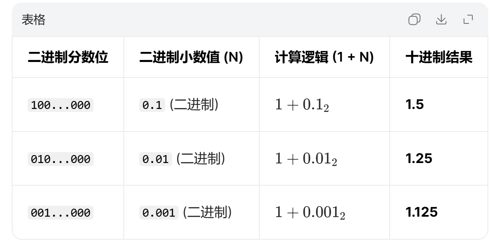

豆包IEEE 754 单精度浮点数公式拆解

---

## 一、先记住核心结论
32 位 float 浮点数，本质上是把一个数表示成科学计数法的二进制形式：
`val = 符号 × 基数 × 指数`

在 IEEE 754 里，就是：
`val = (-1)^S × 2^(E-127) × (1 + N)`

你看到的这个公式，就是把二进制科学计数法映射成十进制值的计算方式。

---

## 二、逐部分拆解公式
### 1. `(-1)^S`：符号位
- `S` 是最高位（第 31 位），只能是 0 或 1。
- `S = 0`：`(-1)^0 = 1` → 正数
- `S = 1`：`(-1)^1 = -1` → 负数
- **作用：控制正负号**

---

### 2. `2^(E-127)`：指数部分
- `E` 是 8 位的指数位（第 30~23 位），范围是 `[1, 254]`（0 和 255 有特殊用途，比如表示 0、无穷、NaN）。
- `E` 是**偏移表示法**，实际指数是 `E - 127`（因为 8 位无符号数的中间值是 127，这样可以表示正负指数）。
- 举个例子：
  - `E = 127` → 实际指数 `0` → `2^0 = 1`
  - `E = 130` → 实际指数 `3` → `2^3 = 8`
  - `E = 120` → 实际指数 `-7` → `2^-7`
- **作用：控制小数点移动的位置，决定数值的大小范围**

---

### 3. `(1 + N)`：尾数部分（分数位）
- `N` 是 23 位的分数位（第 22~0 位），它代表的是二进制小数：
  `N = 0.b₂₂b₂₁...b₀`（二进制）
- 为什么要加 `1`？
  因为在规范化表示中，二进制科学计数法的尾数形式是 `1.xxxx`，整数部分固定为 `1`，所以这个 `1` 是**隐藏的，不占位**，我们看到的 23 位只是小数部分。
- 举个例子：
  - 分数位全 0：`N = 0` → `1 + N = 1.0`
  - 分数位 `100...000`：`N = 0.5` → `1 + N = 1.5`
- **作用：控制数值的精度**

---

## 三、完整例子：把一个 32 位 float 转成十进制
假设我们有一个 32 位 float：
`0 10000010 10000000000000000000000`

1.  **符号位 S**：`0` → 正数
2.  **指数位 E**：`10000010` → 十进制 `130` → 实际指数 `130 - 127 = 3` → `2^3 = 8`
3.  **分数位 N**：`100...000` → `0.5` → `1 + N = 1.5`

代入公式：
`val = 1 × 8 × 1.5 = 12`

这个浮点数就表示十进制的 `12`。

---

### 分数位补充说明

## 四、公式的边界说明
- `E ∈ {1,2,...,254}`：指数位不能全 0 或全 1，这两种情况是特殊值：
  - `E=0`：表示非规范化数（接近 0 的极小值）
  - `E=255`：表示无穷大或 NaN（非数字）
- `1 + N ∈ [1, 2-2^-23]`：因为 N 是 23 位，最大只能是 `0.999...999`（23 个 1），所以 `1+N` 最大是 `2 - 2^-23`。

---

## 五、一句话总结
这个公式的本质，就是把一个 32 位二进制浮点数，拆成「符号 + 指数 + 尾数」三部分，然后用科学计数法的规则，算出它对应的十进制值。

---